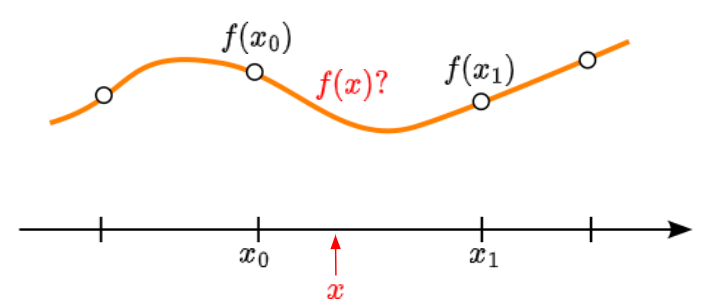
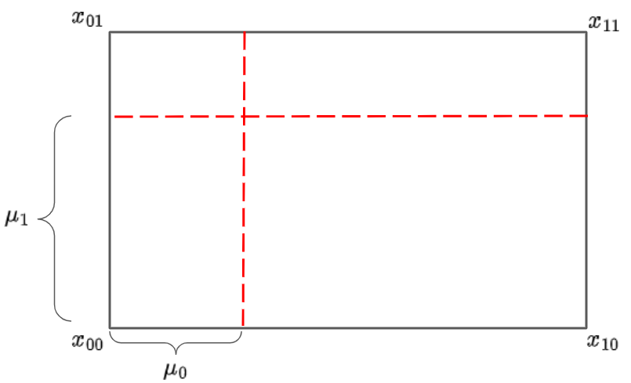
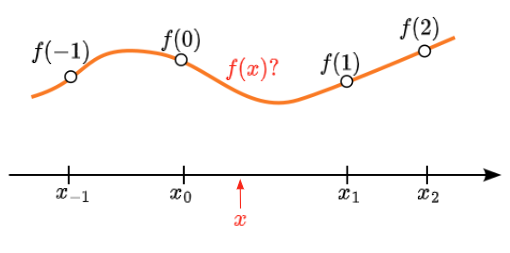
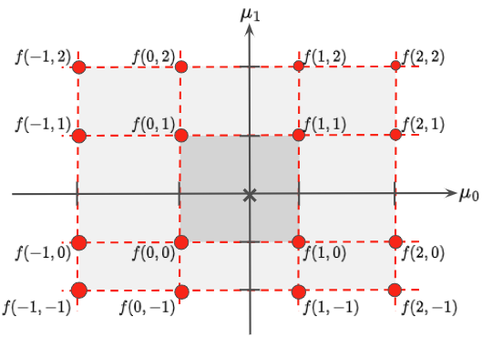
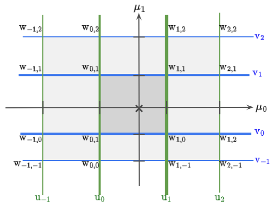

# **Interpolation**

## **How the btwxt library works**
## Big Ladder Software

## 1-D Linear
We do not know the true function $f$. We only know values of $f$ at a set of grid points $x_i$.

To find $f(x)$ for $x$ in $(x_0,x_0)$,

let $\mu=(x-x_0)/(x_1-x_0)$.

$f(x)=(1-\mu)\cdot f(x_0) + \mu \cdot f(x_1)$


<p align="center">
     
</p>

## 2-D Linear
We would like to extend the 1-D interpolation to 2-D.

$$\begin{align*}
f(\mu)=&(1-\mu_1)\cdot [(1-\mu_0)\cdot f(x_{00}) + \mu_0 \cdot f(x_{10})]\\
+&\mu_1\cdot [(1-\mu_{0})\cdot f(x_{01}) + \mu_0 \cdot f(x_{11})]
\end{align*}$$

Or, to do the calculation in one pass:

$$\begin{align*}
f(\mu)=&(1-\mu_0)\cdot (1-\mu_1)\cdot f(x_{00}) + \mu_0\cdot (1-\mu_1)\cdot f(x_{10})\\
+&(1-\mu_0)\cdot \mu_1\cdot f(x_{01}) + \mu_0 \cdot \mu_1\cdot f(x_{11})
\end{align*}$$


<p align="center">
     
</p>

Four independent terms, one for each vertex.

## 2-D Linear pseudocode
We left off with:

$f(x)=(1-\mu_1)\cdot [(1-\mu_0)\cdot f(x_{00}) + \mu_0 \cdot f(x_{10})]+\mu_1\cdot [(1-\mu_{0})\cdot f(x_{01}) + \mu_0 \cdot f(x_{11})]$

f[x]=0;  
for each vertex x<sub>ij</sub> in the rectangle,  
    f[x] += f[x<sub>ij</sub>] $`*`$ (j==0? 1-$`\mu`$<sub>0</sub>: $\mu$<sub>0</sub>) $`*`$ (i==0? 1-$`\mu`$<sub>1</sub>: $\mu$<sub>1</sub>);  
return f[x];


## Hypercube
The N-dimensional bounding box for the point we are interpolating.

If 1-D, a line

If 2-D, a rectangle

If 3-D, a rectangular prism.

The number of vertices of the hypercube = 2<sup>N</sup>.

## N-D Linear pseudocode
f[x]=0;  
for each vertex x<sub>ij...k</sub> in the hypercube:  
    vertex_weight = 1.0;   
    for each dimension $dim$:  
         vertex_weight $`*=`$ (coord $\_{dim}\$ == 0? $1-\mu_{dim}$: $\mu_{dim}$);   
    f[x] += f[x<sub>ij...k</sub>] $`*`$ vertex_weight;  
return f(x);
## 1-D Cubic
Assume $f$ is a degree-3 polynomial:   
     $\ f(x)=a\cdot x^3+b\cdot x^2+c\cdot x+d \$


We need additional information, so let's use the slopes at $f(x_0)$ and $f(x_1)$: $f'(x_0)$ and $f'(x_1)$.

Warning of notation change. I am shortening $f(x_i)$ to $f(i)$ at this point.


<p align="center">
     
</p>

## 1-D Cubic: deriving coefficients
The polynomial can be written:   
     $f(\mu)=a\cdot \mu ^3+b\cdot \mu ^2+c\cdot \mu+d$

Note that   
     $f'=\dfrac{df}{dx}=\dfrac{d\mu}{dx} \cdot \dfrac{df}{d\mu}=\dfrac{1}{\delta_x}\cdot\dfrac{df}{d\mu}$:   

Find the derivative:   
     $f'(\mu)=(3a\cdot \mu^2+2b\cdot \mu+c)/\delta_x$   
where $\delta_x=x_1-x_0$.

Evaluate at 0 and 1:   
     $f(0)=d$   
     $f(1)=a+b+c+d$   
     $f'(0)=c/\delta_x$   
     $f'(1)=(3a+2b+c)/\delta_x$   

Solve for coefficients [^1]:   
     $a=2f(0)-2f(1)+\delta_x\cdot f'(0)+\delta_x\cdot f'(1)$   
     $b=-3f(0)+3f(1)-2\delta_x\cdot f'(0)-\delta_x\cdot f'(1)$   
     $c=\delta_x\cdot f'(0)$   
     $d=f(0)$

Substitute into $f(\mu)$:
```math
\begin{align*}
f(\mu)=&(2\mu^3-3\mu^2+1)\cdot f(0)\\
+&(-2\mu^3+3\mu^2)\cdot f(1)\\
+&(\mu^3-2\mu^2+\mu)\cdot \delta_x\cdot  f'(0)\\
+&(\mu^3-\mu^2)\cdot \delta_x\cdot f'(1)\\
\end{align*}
```
## 1-D Cubic
We know $f(0)$ and $f(1)$. Those are our known grid values. But what about the derivatives?

In Catmull-Rom splines, we use the slope of the line between the previous and next points on the axis as the derivative [^2]:   
     $f'(0)=(f(1)-f(-1))/(x_1-x_{-1})$   
     $f'(1)=(f(2)-f(0))/(x_2-x_0)$  

Define:   
     $c_{0}=2\mu^3-3\mu^2+1, \quad  c_{1}=-2\mu^3+3\mu^2$   
     $d_{0}=\mu^3-2\mu^2+\mu, \quad d_{1}=\mu^3-\mu^2$  
     $s_0=\delta_x/(x_1-x_{-1}), \quad s_1=\delta_x/(x_2-x_0)$

Rewrite the polynomial:   
 $f(\mu)=c_{0}\cdot f(0)+c_{1}\cdot f(1)+d_{0}\cdot s_0\cdot (f(1)-f(-1))+d_{1}\cdot s_1\cdot (f(2)-f(0))$  

Group the coefficients:   
 $f(\mu)=-d_{0}\cdot s_0\cdot f(-1)+(c_{0} -d_{1}\cdot s_1)\cdot f(0)+(c_{1}+d_{0}\cdot s_0)\cdot f(1)+d_{1}\cdot s_1\cdot f(2)$  

## 1-D Cubic, Pseudocode
 
f[x]=0;   
weight = 1.0;   
for i = -1 to 2:   
    switch i:   
        case -1: weight *= -d[0] $`*`$ s[0];     
        case 0: weight *= c[0] - d[1] $`*`$ s[1];  
        case 1: weight *= c[1] + d[0] $`*`$ s[0];   
        case 2: weight *= d[1] $`*`$ s[1];  
    f[x] += f[i] $\*\$ weight;  
return f[x];

Terms $c_{0}$ and $c_{1}$ are referred to programmatically as *interpolation coefficients*.

The terms $d_{0}\cdot s_0$ and  $d_{1}\cdot s_1$ are referred to as *cubic_slope_coefficients*.

## 2-D Cubic, with pictures
There are 4<sup>N</sup> points to weigh. Number of calculations grows faster than that.

<p align="center">
     
</p>

## 2-D Cubic, with pictures
There are 4 weight factors along each axis, 4N total. Points are weighted by the product among all axes of the weight factors for each axis (e.g., u, v): w <sub>i,j</sub>= u<sub>i</sub> $\cdot$ v<sub>j</sub>

<p align="center">
     
</p>


## N-D Cubic/Linear Pseudocode
f[x]=0;  
for point in hypercube:  
     weight = 1.0;   
     for $`dim`$ in ndims:  
         switch point.index($`dim`$):  
               case -1: weight * = -d[$`dim`$][0] $`*`$ s[$`dim`$][0];     
               case 0: weight * = c[$`dim`$][0] - d[$`dim`$][1] $`*`$ s[$`dim`$][1];  
               case 1: weight * = c[$`dim`$][1] + d[$`dim`$][0] $`*`$ s[$`dim`$][0];   
               case 2: weight * = d[$`dim`$][1] $`*`$s[$`dim`$][1];        
     f[x] += f[point] $\*\$ weight;  
return f[x];

## N-D Cubic/Linear Pseudocode
f[x]=0;  
for point in hypercube:  
     weight = 1.0;   
     for $`dim`$ in ndims:  
          if method[$`dim`$] == linear:  
               weight *= (point.index($`dim`$) == 0? 1-$`\mu_{dim}`$ : $`\mu_{dim}`$)  
          else:  switch point.index($dim$):  
               case -1: weight * = -d[$`dim`$][0] $`*`$ s[$`dim`$][0];     
               case 0: weight * = c[$`dim`$][0] - d[$`dim`$][1] $`*`$ s[$`dim`$][1];  
               case 1: weight * = c[$`dim`$][1] + d[$`dim`$][0] $`*`$ s[$`dim`$][0];   
               case 2: weight * = d[$`dim`$][1] $`*`$ s[$`dim`$][1];        
     f[x] += f[point] $`*`$ weight;  
return f[x];

[^1]: http://www.mvps.org/directx/articles/catmull/
[^2]: https://en.wikipedia.org/wiki/Cubic_Hermite_spline#Catmull%E2%80%93Rom_spline
