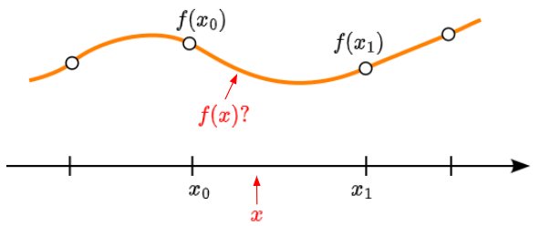
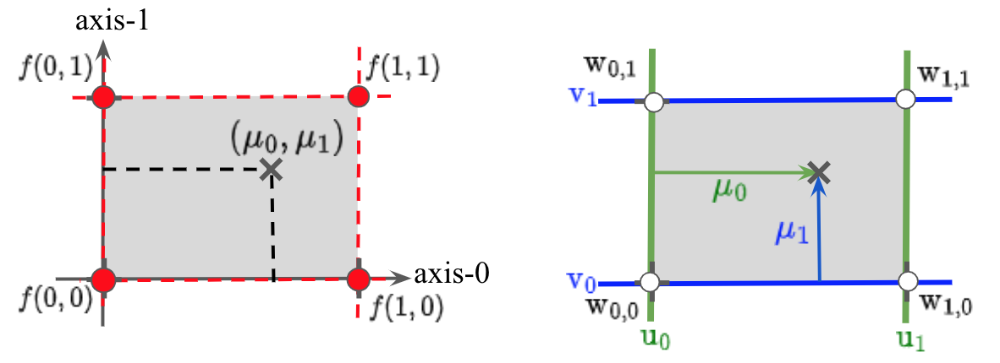
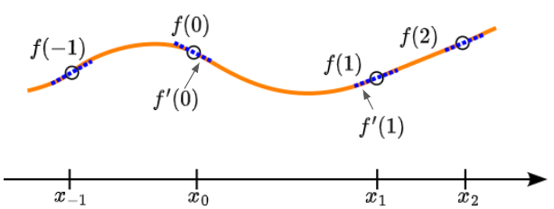
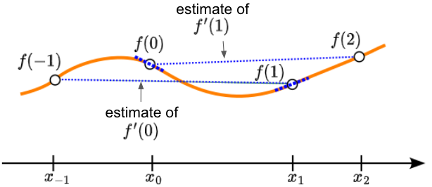

# btwxt Methodology
## *Big Ladder Software*
## Overview
**btwxt** is a C++ library that performs multidimensional *interpolation*. Interpolation of a function, $f(x)$, is used when the function values are known only at a discrete set of grid-axis coordinates. We refer to the coordinates as $x_i$, and the function values at those coordinates as $f(x_i)$. Interpolation allows estimating the function at any arbitrary, intermediate coordinate, $x$. We can constrain our focus to the interval between any two, sequential grid-axis coordinates, say $x_0$ and $x_1$,  without loss of generality.

<p align="center">
     
</p>

There are several approaches to interpolate a discrete set of known function values. For any single axis, **btwxt** supports both *linear* and *cubic* interpolation. The mathematical bases for these methods are described in this document. 

**btwxt** also enables the interpolation of data sets that span multiple dimensions in parameter space. This requires combining the variation of the function with respect to each axis. This document also contains a description of the algorithm used to perform this N-dimensional interpolation.
    
##  Linear Interpolation
Linear interpolation along an axis is often sufficient if either of the following conditions apply:
1) the known function values are closely spaced, such that variations between neighboring points are within acceptable tolerances, or
2) the function itself is expected to follow a linear (constant slope) trend between any two known, adjacent grid-axis points.  

We let $\mu=(x-x_0)/(x_1-x_0)$, and identify $f(\mu)$ for $0\leq\mu\leq1$. The linear interpolation has the form:

&ensp; &ensp; $f(\mu)=a+b\cdot\mu$

### Coefficient determination
We require that $f(\mu)$ contain the function values at $x_0$ and $x_1$. 
In 1-D, we will represent $f(x_i)$ by $f(i)$, for simplicity. Evaluate at 0 and 1:

&ensp; &ensp; $f(0)=a$
     
&ensp; &ensp; $f(1)=a+b$

Then

&ensp; &ensp; $a=f(0)$

&ensp; &ensp; $b=f(1)-f(0)$

For clarity, we can organize terms as shown below, to develop the general algorithm:

$$
\begin{align*}
f(\mu)\quad=
&\quad &C_0&\cdot \quad f(0)\\
&\quad+ &C_1&\cdot \quad f(1)
\end{align*}
$$

The coefficients are easily identified as

&ensp; &ensp; $C_0=1-\mu, \quad  C_1=\mu$

These are labeled `interpolation_coefficients` in the **btwxt** source code . Notice that sum of these coefficients is unity, ensuring that the interpolation returns a weighted average of the neighboring function values. More generally, we refer to the coefficients mutliplying the function values as *weights*, or `weighting_factors`. 

The linearly interpolated function $f(\mu)$ consists of a train of straight-line segments connecting each pair of neighboring points. 
<p align="center">
     
</p>

### Multidimensional linear
**btwxt** performs interpolations spanning an arbritrary number of grid-axis dimensions. Analytically, we can extend the 1-D interpolation to a two-dimensional (2-D) data set as follows:

$$
\begin{align*}
f(\mu_0,\mu_1)\quad=
&\quad(1-\mu_1)&\cdot \quad&[(1-\mu_0)\cdot f(x_{00}) + \mu_0 \cdot f(x_{10})]\\
&\quad+\mu_1&\cdot \quad&[(1-\mu_{0})\cdot f(x_{01}) + \mu_0 \cdot f(x_{11})]
\end{align*}
$$

For the purpose of computation, the equation above is expanded, so that each neighboring function value appears exactly once:

$$
\begin{align*}
f(\mu_0,\mu_1)\quad=
&\quad(1-\mu_0)\cdot (1-\mu_1)&\cdot \quad f(x_{00})\\ 
&\quad+\mu_0\cdot (1-\mu_1)&\cdot \quad f(x_{10})\\
&\quad+(1-\mu_0)\cdot \mu_1&\cdot  \quad f(x_{01})\\
&\quad+\mu_0 \cdot \mu_1&\cdot  \quad f(x_{11})
\end{align*}
$$

<p align="center">
     
</p>

The cofficient that multiplies each function value comprises the weight of the vertex located at the  grid point coordinates. Each 2-D weight is simply the product of the weight terms associated with each of the two axes. Notice that there are two unique weight factors (i.e., $\mu_i$ and $1-\mu_i$) associated with each axis, so we must evaluate $2+2=4$ single-axis weights, in total. These are then combined to form $2\cdot 2=4$ weights for the full rectangle. The extension of this formulation to an N-dimensional (N-D) parameter space is straightforward.

In general, the N-D bounding box at any specified coordinates is referred to as a *hypercube*. In 1-D, this simply consists of the interval (line) between the neighboring grid-axis coordinates. In 2-D, the hypercube encloses a rectangular area. In 3-D, it enscribes a rectangular prism. 

For an N-D system, when linear interpolation is applied along all axes, the hypercube is bounded by 2<sup>N</sup> vertices. That is, the number of vertices that affect the interpolation doubles with each added dimension.

All known function values will be precisely reproduced by a linear interpolation, and the interpolated function will be continuous. However, the slope of this interpolation will not be continuous, and a smoother form of spline may be desireable. This condition can be met by a cubic interpolation.

## Cubic Interpolation
Assume $f(\mu)$ is a degree-3 polynomial:

&ensp; &ensp; $f(\mu)=a+b\cdot \mu+c\cdot \mu ^2+d\cdot \mu ^3$

The expression above has four unknown coefficients, so we need more information than just the two neighboring function values, $f(0)$ and $f(1)$. It is sufficient for this purpose to use the approximate slopes at $x_0$ and $x_1$, labeled $f'(0)$ and $f'(1)$, respectively.

<p align="center">
     
</p>

### Coefficient determination
To express the derivate in terms of $\mu$, we use

&ensp; &ensp; $f'=\dfrac{df}{dx}=\dfrac{d\mu}{dx} \cdot \dfrac{df}{d\mu}=\dfrac{1}{x_1-x_0}\cdot\dfrac{df}{d\mu}$  

Now take the derivative of the cubic function:

&ensp; &ensp; $f'(\mu)=(b+2c\cdot \mu+3d\cdot \mu^2)/(x_1-x_0)$

Evaluate at 0 and 1:

&ensp; &ensp; $f(0)=a$
     
&ensp; &ensp; $f(1)=a+b+c+d$
     
&ensp; &ensp; $f'(0)=b/(x_1-x_0)$
     
&ensp; &ensp; $f'(1)=(b+2c+3d)/(x_1-x_0)$
     

We can invert ths system of equations to find the coefficients:[^1]

&ensp; &ensp; $a=f(0)$

&ensp; &ensp; $b=(x_1-x_0)\cdot f'(0)$
     
&ensp; &ensp; $c=-3f(0)+3f(1)-2(x_1-x_0)\cdot f'(0)-(x_1-x_0)\cdot f'(1)$
     
&ensp; &ensp; $d=2f(0)-2f(1)+(x_1-x_0)\cdot f'(0)+(x_1-x_0)\cdot f'(1)$
     
Substitute into $f(\mu)$ and arrange the coefficient sums in descending powers of $\mu$:

$$
\begin{align*}
f(\mu)=
&\quad(2\mu^3-3\mu^2+1)&\cdot\quad &f(0)\\
&\quad+(-2\mu^3+3\mu^2)&\cdot\quad &f(1)\\
&\quad+(\mu^3-2\mu^2+\mu)\cdot (x_1-x_0)&\cdot\quad  &f'(0)\\
&\quad+(\mu^3-\mu^2)\cdot (x_1-x_0)&\cdot\quad &f'(1)\\
\end{align*}
$$

### Slope estimation
Whereas we know the function values, $f(0)$ and $f(1)$, we can only estimate the slopes, $f'(0)$ and $f'(1)$, from the data, itself. Several methods for estimating these slopes have been proposed.[^2] A common assumption is that the slope at any grid point is equal to that of the line containing the previous and next points on the axis:

&ensp; &ensp; $f'(0)=(f(1)-f(-1))/(x_1-x_{-1})$

&ensp; &ensp; $f'(1)=(f(2)-f(0))/(x_2-x_0)$

<p align="center">
     
</p>

Now we have
$$
\begin{align*}
f(\mu)=
&\quad(2\mu^3-3\mu^2+1)&\cdot\quad &f(0)\\
&\quad+(-2\mu^3+3\mu^2)&\cdot\quad &f(1)\\
&\quad+(\mu^3-2\mu^2+\mu)\cdot (x_1-x_0)/(x_1-x_{-1})&\cdot\quad  &(f(1)-f(-1))\\
&\quad+(\mu^3-\mu^2)\cdot (x_1-x_0)/(x_2-x_0)&\cdot\quad &(f(2)-f(0))\\
\end{align*}
$$

In the cubic case, the `interpolation_coefficents` have the following forms:

&ensp; &ensp; $C_0=2\mu^3-3\mu^2+1, \quad  C_1=-2\mu^3+3\mu^2$

The following two variables are labeled in **btwxt** source code as `cubic_slope_coefficients`.

&ensp; &ensp; $D_0=(\mu^3-2\mu^2+\mu)\cdot S_0, \quad D_1=(\mu^3-\mu^2)\cdot S_1$

The ratios

&ensp; &ensp; $S_0=(x_1-x_0)/(x_1-x_{-1}), \quad S_1=(x_1-x_0)/(x_2-x_0)$

are assigned to variables in **btwxt** labeled `cubic_spacing_ratios`. 


We can rewrite the polynomial:   

$$
\begin{align*}
f(\mu)=
&\quad\quad C_0&\cdot\quad &f(0)\\
&\quad+C_1&\cdot\quad &f(1)\\
&\quad+D_0&\cdot\quad &(f(1)-f(-1))\\
&\quad+D_1&\cdot\quad &(f(2)-f(0))
\end{align*}
$$

Finally, identify the coefficients for the individual function values:

$$
\begin{align*}
f(\mu)=&-D_0&\cdot\quad &f(-1)\\
&+(C_0 - D_1)&\cdot \quad &f(0)\\
&+(C_1+D_0)&\cdot\quad &f(1)\\
&+D_1&\cdot\quad &f(2)
\end{align*}
$$

<p align="center">
     
</p>

### Edge case
The above formulation allows cubic interpolation using the four function values associated with the grid-point coordinates in the vicinity of the queried coordinate. Notice that our slope estimations must be revised for edge cases, i.e., when either $x_0$ or $x_1$ represent the smallest or largest values, respectively, of the provided grid-axis coordinates. These cases can be handled by assigning the slope $(f(1)-f(0))/(x_1-x_0)$ to either $f'(0)$ or $f'(1)$, if either $x_{-1}$ or $x_2$, respectively, are outside the valid interpolation range.

An equivalent method is used by **btwxt** to enforce this: If $x_0$ is the minimum coordinate, the assigments

&ensp; &ensp; $S_0\gets 1$, $f(-1)\gets f(0)$

are applied. If $x_1$ is the maximum coordinate, the assignments

&ensp; &ensp; $S_1\gets 1$ , $f(2)\gets f(1)$

are applied. 

### Multidimensional cubic
Cubic interpolation along both axes of a 2-D system involves $4^2=16$ points, as shown below.

<p align="center">
     
</p>

As for the 2-D case, the coefficient for each vertex is the product of the coefficients computed for each axis, separately. Therefore, we first find the $2\cdot4=8$ single-axis coefficients, then we evaluate each of the $4^2=16$ pair products, which are the combined weighting factors for the 2-D vertices.

For example, let us label the weighting factors for axis-0 as u<sub>i</sub>. Those for axis-1 we will label as  v<sub>j</sub>. Then the combined weighting factor for vetex i,j is given by w<sub>i,j</sub>= u<sub>i</sub> $\cdot$ v<sub>j</sub>

<p align="center">
     
</p>

Again, the extension to the N-D case is straightforward. If cubic interpolation is applied to all axes, a hypercube about each queried coordinate will contain 4<sup>N</sup> vertices.
There are four coefficients along each axis, with a total of 4N single-axis weighting factors. Each vertex is weighted by the product among all axes of the weighting factors for each axis.

## Extrapolation
**btwxt** also enables *extrapolation* for estimation of the function outside the valid interpolation range. Two methods for extrapolation are available: *constant* and *linear*. If constant is selected, the function value for extrapolation is assumed to equal that of the nearest endpoint. A linear extrapolation returns the function value of the nearest endpoint at the grid-point coordinate for that endpoint, and has the slope assigned to that endpoint.

## General Pseudocode
Pseudocode for the described algorithm is listed below.
```c++
/*
Routine to compute weights of points in a hypercube.
*/ 
for dim in ndims:
	mu = (x[dim] - x[dim][0]) / (x[dim][1] - x[dim][0]);
	if method[dim] == linear:
	   interp_coef[dim][0] = 1 - mu;
	   interp_coef[dim][1] = mu;
	   cubic_slope_coef[dim][0] = cubic_slope_coef[dim][1] = 0;
	else:
	   interp_coef[dim][0] = 2 * mu * mu * mu - 3  * mu * mu + 1;
	   interp_coef[dim][1] = -2 * mu * mu * mu + 3  * mu * mu;
	   cubic_slope_coef[dim][0] = (mu * mu * mu - 2  * mu * mu + mu) * cubic_spacing_ratio[dim][0];
	   cubic_slope_coef[dim][1] = (mu * mu * mu - mu * mu) * cubic_spacing_ratio[dim][1];

	weight_fact[dim][-1] = -cubic_slope_coef[dim][0];
	weight_fact[dim][0] = interp_coeff[dim][0] - cubic_slope_coef[dim][1];
	weight_fact[dim][1] = interp_coef[dim][1] + cubic_slope_coef[dim][0];   
	weight_fact[dim][2] = cubic_slope_coef[dim][1];          
```

```c++
/*
Routine to compute interpolated value at x for an N-D system by summing over the 
weighted function values for all vertices of a hypercube.
*/
f(x) = 0;  
for vertex in hypercube:
	weight = 1.0;
 	for dim in ndims:        
     	weight *= weight_fact[dim][vertex.index(dim)];
	f(x) += f(vertex) * weight;  
return f(x);
```
[^1]: http://www.mvps.org/directx/articles/catmull/
[^2]: https://en.wikipedia.org/wiki/Cubic_Hermite_spline#Catmull%E2%80%93Rom_spline
